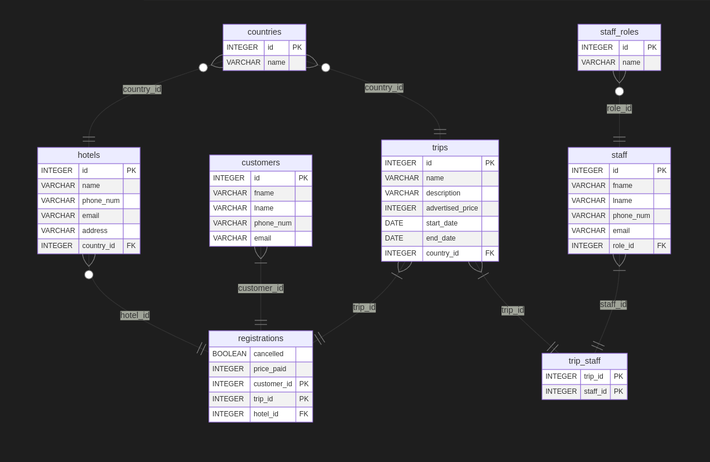

# SQLAlchemy-Mermaid

Mosty a quick (and dirty) script to generate a [mermaid](https://mermaid-js.github.io/mermaid/) erDiagram from [SQLAlchemy](https://github.com/sqlalchemy/sqlalchemy) metadata object

## Usage

```python
from sqlalchemy.ext.declarative import declarative_base
from sqlalchemy_mermaid import create_mermaid_diagram

Base = declarative_base()

# Define tables here or import Base from somewhere else

print("```mermaid")
print(create_mermaid_diagram(Base))
print("```")

# python script.py > db_diagram.md
```

Example result (after rendering in VSCode):

