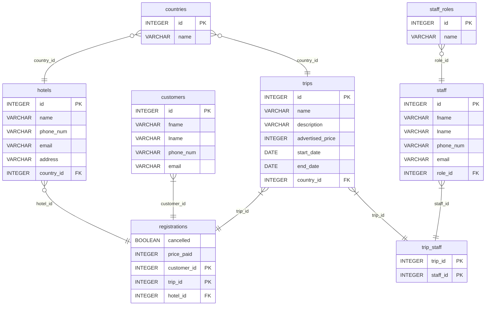

```mermaid
erDiagram

  trips {
    INTEGER id PK
    VARCHAR name
    VARCHAR description
    INTEGER advertised_price
    DATE start_date
    DATE end_date
    INTEGER country_id FK
  }

  trip_staff {
    INTEGER trip_id PK
    INTEGER staff_id PK
  }

  registrations {
    BOOLEAN cancelled
    INTEGER price_paid
    INTEGER customer_id PK
    INTEGER trip_id PK
    INTEGER hotel_id FK
  }

  customers {
    INTEGER id PK
    VARCHAR fname
    VARCHAR lname
    VARCHAR phone_num
    VARCHAR email
  }

  countries {
    INTEGER id PK
    VARCHAR name
  }

  hotels {
    INTEGER id PK
    VARCHAR name
    VARCHAR phone_num
    VARCHAR email
    VARCHAR address
    INTEGER country_id FK
  }

  staff {
    INTEGER id PK
    VARCHAR fname
    VARCHAR lname
    VARCHAR phone_num
    VARCHAR email
    INTEGER role_id FK
  }

  staff_roles {
    INTEGER id PK
    VARCHAR name
  }

  staff_roles  }o--|| staff : "role_id"
  countries  }o--|| hotels : "country_id"
  customers  }|--|| registrations : "customer_id"
  trips  }|--|| registrations : "trip_id"
  hotels  }o--|| registrations : "hotel_id"
  trips  }|--|| trip_staff : "trip_id"
  staff  }|--|| trip_staff : "staff_id"
  countries  }o--|| trips : "country_id"

```
